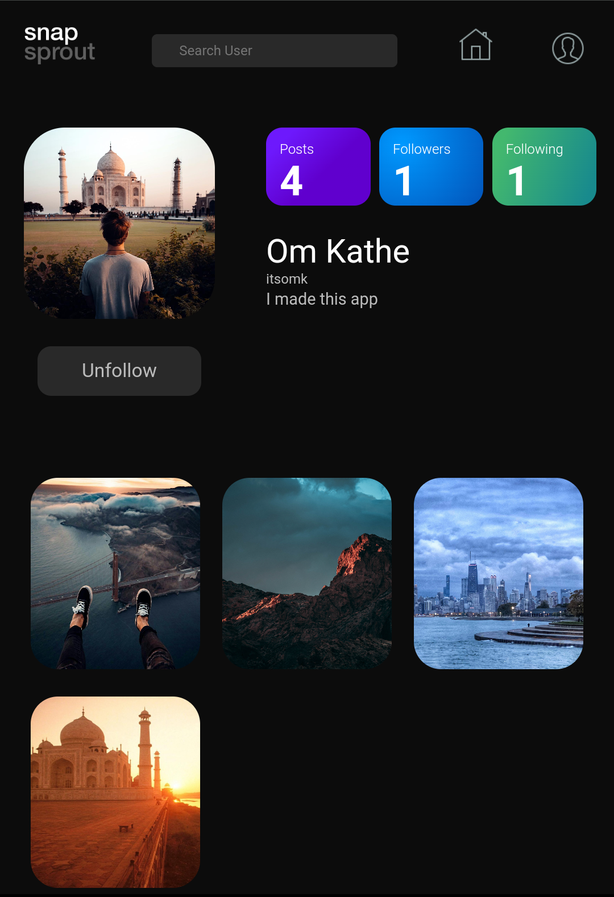
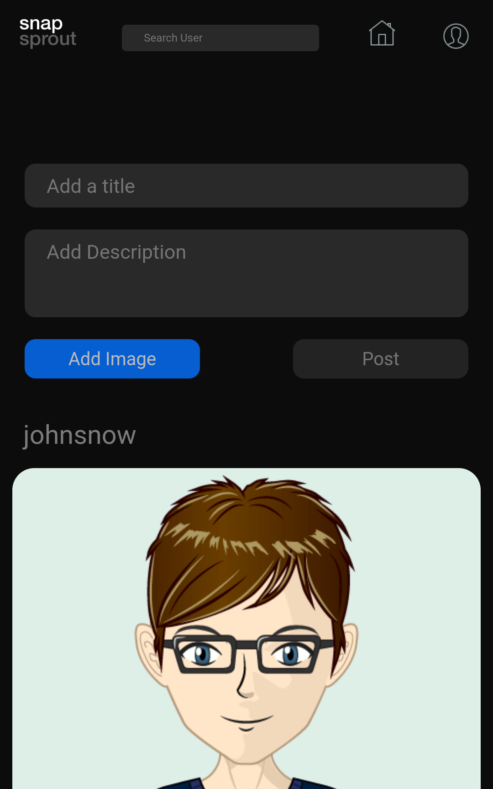

    <h4 align = "left">    
    </h4>

<h2 align = "left"> About </h2>

snapsprout lets you share photos, like and comment, follow your friends and more.

<h2 align = "left">Run on local machine</h2>

Fork this repository
  
Clone this repository in your desired folder by 
  
<pre><code>$ git clone https://github.com/{YourUsername}/Snapsprout</code></pre>
Make sure to have NodeJS installed
	
<h3>For frontend</h3>
 
<pre><code>$ cd frontend</code></pre>
Install the dependancies
  
<pre><code>$ npm install</code></pre>
Start the React modules
  
<pre><code>$ npm start</code></pre>

<h3>For backend</h3>
 
Install the dependancies
  
<pre><code>$ npm install</code></pre>
Create new .env file and add
<pre><code>MONGOURI = {Add your mongodb atlas URL here}</code></pre>
<pre><code>JWT_SECRET = {Add a secret string of length 32+ characters}</code></pre>
Start the React modules
  
<pre><code>$ npm run startdev</code></pre>

<h3>License</h3>

Project is licensed under <a href = "https://www.gnu.org/licenses/gpl-3.0.en.html" target = "_blank">GNU Public License</a>

    <h3>Screenshots</h3>
    
    
    

